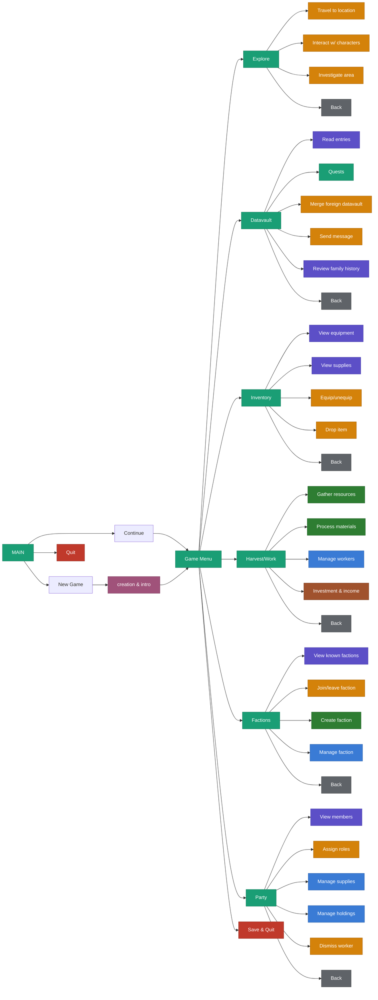

# game-tempname

| Diagram Colors |
|--------|
| Violet: view info |
| Teal: menu |
| Blue: manage |
| Yellow: slection |
| Red: exit program |
| Green: unique/user input |
| Gray: go to previous menu |
| Brown: data report |
| Rose: narrative |

